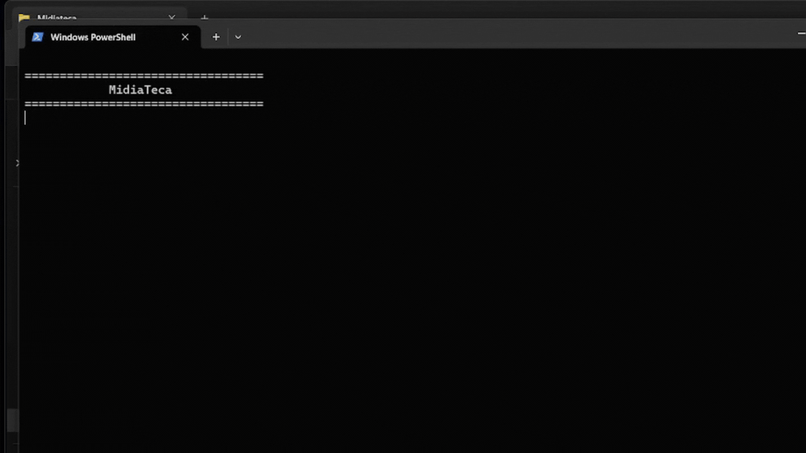

# 📚 Midiateca (Media Tracker)

> A robust Command Line Interface (CLI) application developed in Python to manage, track, and rate your personal collection of books, movies, series, animes, and games.

## 💡 Introduction

As a developer passionate about organization and media consumption, I built the **Midiateca** to solve a common problem: keeping track of everything I watch, read, and play in one centralized place. Instead of relying on multiple apps or scattered spreadsheets, this project provides a unified, efficient, and interactive terminal-based solution.

This project serves as a practical application of Python's Object-Oriented Programming (OOP) principles, relational database management with SQLite, and building intuitive CLI user experiences.



## 🎯 What the Project Does

The **Midiateca** empowers users to build their own digital library. The application acts as a comprehensive media tracker that:
* **Supports Multiple Media Types:** Manage Books, Movies, Series, Animes, and Games, each with their own specific attributes (e.g., pages for books, duration for movies, seasons for series, play time for games).
* **Interactive CLI Menu:** Offers a user-friendly and highly structured menu directly in the terminal for seamless navigation and data entry.
* **Persistent Storage:** Uses a robust SQLite database (`tracker_midias.db`) to ensure your collection is safely stored and easily retrievable across sessions.
* **Detailed Tracking:** Keeps track of essential information such as release year, completion status, personal rating (score), and genre for every item in your collection.

## 🚧 Development Journey & Overcoming Challenges

Building this project was a fantastic opportunity to deepen my understanding of software architecture and database integration in Python. Key challenges I tackled included:

1. **Object-Oriented Design (OOP):**
   Implementing a solid class hierarchy was crucial. I utilized inheritance to create a base `Midia` class and specialized subclasses (`Livro`, `Filme`, `Serie_Anime`, `Jogo`) to handle unique attributes cleanly and efficiently.

2. **Database Integration with SQLite:**
   Transitioning from in-memory lists to persistent database storage required careful SQL query construction and database connection management to ensure data integrity and smooth CRUD (Create, Read, Update, Delete) operations.

3. **CLI User Experience:**
   Designing an interface that is strictly text-based yet intuitive required meticulous formatting and input validation to guide the user without causing crashes or confusion.

## 🚀 How to Run the Project

You can easily run this project on your local machine by following these steps:

**Prerequisites:**
* Make sure you have Python 3.x installed on your system.

**1. Clone the repository:**
```bash
git clone https://github.com/felpmrts/Midiateca.git
cd Midiateca
```

**2. Run the application:**
```bash
python main.py
```
*Note: Depending on your system, you might need to use `python3 main.py`.*

## 🛠️ Technologies & Skills Used

* **Language:** Python 3
* **Database:** SQLite3
* **Architecture:** Modular architecture (Core Models, CLI Views, Database Connection)
* **Key Concepts:** Object-Oriented Programming (Inheritance, Encapsulation), CLI Interface Design, CRUD Operations, Relational Database Management.

---
Developed with 💻 and ☕ by Felipe César Martins
